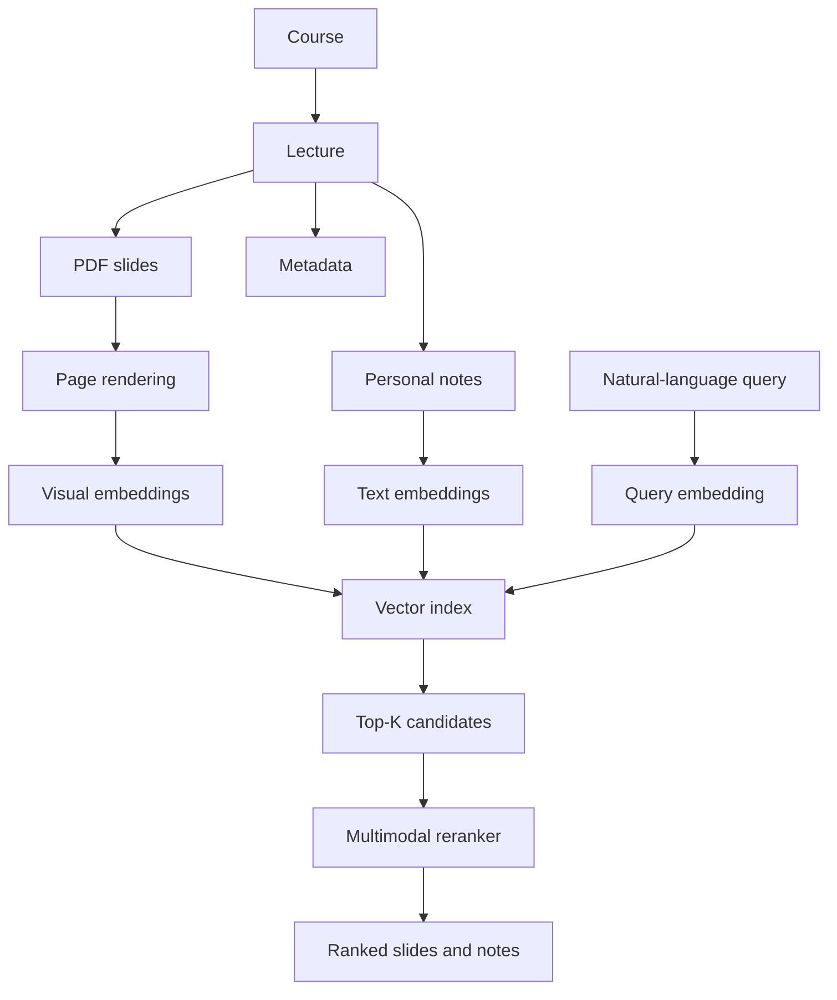

# Lecture Memory

Lecture Memory is a local, multimodal study-memory system designed to help students find where an idea appeared across lecture slides and personal notes—even when they cannot remember the exact wording, lecture, or page.

> **Development status:** Early-stage implementation. PDF ingestion and slide embedding are available; vector retrieval and the user interface are planned but not yet available.

## Why Lecture Memory?

Students often remember *seeing* a diagram, equation, explanation, or handwritten note without remembering where it came from. Traditional keyword search is often ineffective when the useful information is contained in visual layouts, mathematical notation, screenshots, or personal shorthand.

Lecture Memory is intended to create a persistent, searchable memory organized around courses and lectures rather than isolated documents.

Example searches:

```text
Where did the professor explain convex sets?
Find the slide showing convex and non-convex shapes.
When did we discuss three-subproblem integer multiplication?
Find my note about why Karatsuba is faster.
```

## Planned Experience

The first complete version will allow a student to:

- organize materials by course and lecture;
- upload lecture PDFs and render individual slide pages;
- attach notes to a lecture or a specific slide;
- search slides and notes with natural-language queries;
- retrieve visually or semantically relevant pages;
- rerank results and inspect the corresponding slide preview;
- evaluate retrieval quality with a reproducible benchmark.

Lecture Memory is a retrieval system, not a generic PDF chatbot. Answer generation, lecture recording, transcription, agents, and knowledge graphs are intentionally outside the initial scope.

## Architecture



Planned core stack:

- Python 3.11+
- FastAPI, Pydantic, SQLAlchemy, and SQLite
- Streamlit
- PyMuPDF and Pillow
- Qwen multimodal embeddings and reranking
- FAISS
- pytest and Ruff

## Project Status

- [x] Project packaging and repository structure
- [x] pytest and Ruff configuration
- [x] Import smoke test
- [x] Application configuration
- [x] SQLite and SQLAlchemy database foundation
- [x] Course persistence
- [x] Lecture persistence and Course–Lecture relationships
- [x] Note persistence with optional slide-page references
- [x] Slide-page persistence and validated note-page relationships
- [x] PDF page rendering
- [x] Idempotent PDF ingestion pipeline
- [x] PDF text-layer extraction
- [x] Model-independent embedding provider interface
- [x] Qwen3-VL-Embedding-2B feasibility validation on Apple Silicon ([report](benchmark/QWEN3_VL_FEASIBILITY.md))
- [x] Production Qwen3-VL embedding provider
- [x] Persistent embedding cache with content-hash invalidation
- [x] Lecture slide-page embedding pipeline with per-page failure isolation
- [ ] Vector retrieval and filtering
- [ ] Multimodal reranking
- [ ] Streamlit interface
- [ ] Retrieval benchmark and evaluation

Development is intentionally incremental. Each stage is tested before the next major capability is introduced.

## Getting Started

The current repository contains the project foundation and development tooling. It does not yet provide a runnable end-user application.

```bash
git clone https://github.com/taotaokt/LectureMemory.git
cd LectureMemory

python3.11 -m venv .venv
source .venv/bin/activate
python -m pip install -e '.[dev]'
```

Run the checks:

```bash
pytest
ruff check .
```

### Optional Qwen embedding runtime

The base installation stays lightweight. Users who want to generate embeddings should install
the Qwen dependencies and create the local configuration with the following complete setup:

```bash
git clone https://github.com/taotaokt/LectureMemory.git
cd LectureMemory

python3.11 -m venv .venv
source .venv/bin/activate
python -m pip install --upgrade pip
python -m pip install -e '.[dev,qwen]'
cp .env.example .env
```

If the base development environment is already installed, only this additional command is
needed:

```bash
python -m pip install -e '.[qwen]'
```

No separate model-download command, model URL, or Hugging Face token is required for the default
public model. Keep these values in `.env` unless a different device or local model directory is
needed:

```dotenv
DEVICE=auto
MODEL_NAME=Qwen/Qwen3-VL-Embedding-2B
EMBEDDING_DTYPE=auto
EMBEDDING_DIMENSION=2048
```

Installing this optional runtime and downloading the default model require significant disk
space:

- `Qwen/Qwen3-VL-Embedding-2B` model weights occupy approximately **4 GiB**;
- the Python model runtime and its dependencies may occupy approximately **1 GiB**;
- keep at least **8 GiB of free disk space** available for the installation, download,
  temporary files, and cache overhead.

The model weights are **not bundled with this repository**. The provider loads PyTorch lazily
and automatically downloads the model from Hugging Face on the first embedding inference. The
first indexing or search operation can therefore take several minutes, depending on the network
connection, before inference begins. A network connection is required for this initial download;
after it completes, later runs reuse the cached files automatically.

By default, Hugging Face stores the downloaded model in its shared user cache (commonly
`~/.cache/huggingface/hub`) rather than under this repository. Set `HF_HOME` to choose a
different cache location, or set `MODEL_NAME` to an already-downloaded local model directory for
offline use. Model weights and Hugging Face caches are ignored by Git.

If the automatic download fails, check that the machine has at least 8 GiB of free space, can
reach Hugging Face, and has permission to write to the configured cache directory, then retry.
An interrupted Hugging Face download can normally resume rather than restarting from zero.

With `DEVICE=auto`, the provider selects CUDA first, Apple MPS second, and CPU as a fallback.
CPU mode is supported, but embedding a large slide collection can be substantially slower;
Apple Silicon or a CUDA-capable GPU is recommended.

```python
from app.config import get_settings
from app.embeddings import Qwen3VLEmbeddingProvider

settings = get_settings()
provider = Qwen3VLEmbeddingProvider(
    model_name=settings.model_name,
    device=settings.device,
    dtype=settings.embedding_dtype,
    dimension=settings.embedding_dimension,
    batch_size=settings.embedding_batch_size,
    max_pixels=settings.embedding_max_pixels,
    query_instruction=settings.embedding_query_instruction,
)

query_vector = provider.embed_query("Where did we discuss convex sets?")
slide_vector = provider.embed_image("data/rendered/course-1/lecture-3/page-001.png")
similarity = float(query_vector @ slide_vector)
```

Embedding vectors are stored as atomic `.npy` files under `EMBEDDING_DIR`, while SQLite keeps
the entity type and ID, model name, vector dimension, relative file path, content hash, and
creation time. Unchanged content reuses its vector; changed, missing, or corrupt entries are
recomputed safely. `embed_lecture_slides` processes every persisted page in a lecture, reports
generated, cached, and failed page counts, and isolates individual page failures so the remaining
pages can still be indexed.

## Planned Retrieval Evaluation

Retrieval quality will be measured rather than inferred from demonstrations. The benchmark will use realistic student queries and report:

- Recall@1, Recall@5, and Recall@10;
- Mean Reciprocal Rank (MRR);
- embedding, retrieval, reranking, and total query latency;
- comparisons between BM25, multimodal embeddings, and embeddings with reranking.

Private or copyrighted lecture materials will not be committed to the repository.

## Repository Layout

```text
app/          Application, ingestion, embedding, and retrieval packages
frontend/     Streamlit pages and components
benchmark/    Retrieval datasets, metrics, and experiment results
scripts/      Ingestion, indexing, and evaluation entry points
tests/        Automated tests
data/         Local source files and generated artifacts (Git-ignored)
```

The detailed product specification and implementation plan are available in [PROJECT_SPEC.md](PROJECT_SPEC.md).
