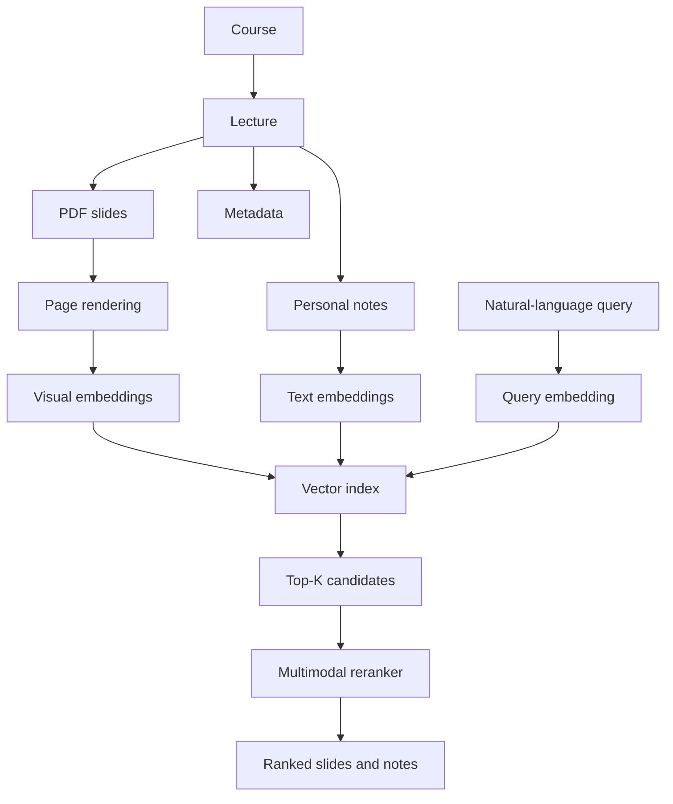

# Lecture Memory

Lecture Memory is a local, multimodal study-memory system designed to help students find where an idea appeared across lecture slides and personal notes—even when they cannot remember the exact wording, lecture, or page.

> **Development status:** Early-stage implementation. The repository foundation is complete; PDF ingestion, retrieval, and the user interface are planned but not yet available.

## Why Lecture Memory?

Students often remember *seeing* a diagram, equation, explanation, or handwritten note without remembering where it came from. Traditional keyword search is often ineffective when the useful information is contained in visual layouts, mathematical notation, screenshots, or personal shorthand.

Lecture Memory is intended to create a persistent, searchable memory organized around courses and lectures rather than isolated documents.

Example searches:

```text
Where did the professor explain convex sets?
Find the slide showing convex and non-convex shapes.
When did we discuss three-subproblem integer multiplication?
Find my note about why Karatsuba is faster.
```

## Planned Experience

The first complete version will allow a student to:

- organize materials by course and lecture;
- upload lecture PDFs and render individual slide pages;
- attach notes to a lecture or a specific slide;
- search slides and notes with natural-language queries;
- retrieve visually or semantically relevant pages;
- rerank results and inspect the corresponding slide preview;
- evaluate retrieval quality with a reproducible benchmark.

Lecture Memory is a retrieval system, not a generic PDF chatbot. Answer generation, lecture recording, transcription, agents, and knowledge graphs are intentionally outside the initial scope.

## Architecture



Planned core stack:

- Python 3.11+
- FastAPI, Pydantic, SQLAlchemy, and SQLite
- Streamlit
- PyMuPDF and Pillow
- Qwen multimodal embeddings and reranking
- FAISS
- pytest and Ruff

## Project Status

- [x] Project packaging and repository structure
- [x] pytest and Ruff configuration
- [x] Import smoke test
- [x] Application configuration
- [x] SQLite and SQLAlchemy database foundation
- [ ] Course, lecture, slide, and note persistence
- [ ] PDF ingestion and page rendering
- [ ] Text extraction
- [ ] Embedding providers and cache
- [ ] Vector retrieval and filtering
- [ ] Multimodal reranking
- [ ] Streamlit interface
- [ ] Retrieval benchmark and evaluation

Development is intentionally incremental. Each stage is tested before the next major capability is introduced.

## Getting Started

The current repository contains the project foundation and development tooling. It does not yet provide a runnable end-user application.

```bash
git clone https://github.com/taotaokt/LectureMemory.git
cd LectureMemory

python3.11 -m venv .venv
source .venv/bin/activate
python -m pip install -e '.[dev]'
```

Run the checks:

```bash
pytest
ruff check .
```

## Planned Retrieval Evaluation

Retrieval quality will be measured rather than inferred from demonstrations. The benchmark will use realistic student queries and report:

- Recall@1, Recall@5, and Recall@10;
- Mean Reciprocal Rank (MRR);
- embedding, retrieval, reranking, and total query latency;
- comparisons between BM25, multimodal embeddings, and embeddings with reranking.

Private or copyrighted lecture materials will not be committed to the repository.

## Repository Layout

```text
app/          Application, ingestion, embedding, and retrieval packages
frontend/     Streamlit pages and components
benchmark/    Retrieval datasets, metrics, and experiment results
scripts/      Ingestion, indexing, and evaluation entry points
tests/        Automated tests
data/         Local source files and generated artifacts (Git-ignored)
```

The detailed product specification and implementation plan are available in [PROJECT_SPEC.md](PROJECT_SPEC.md).
